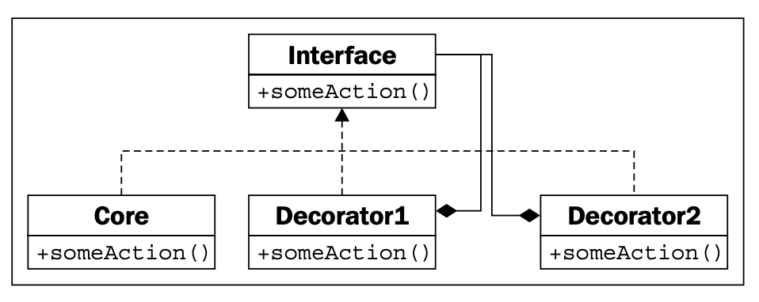
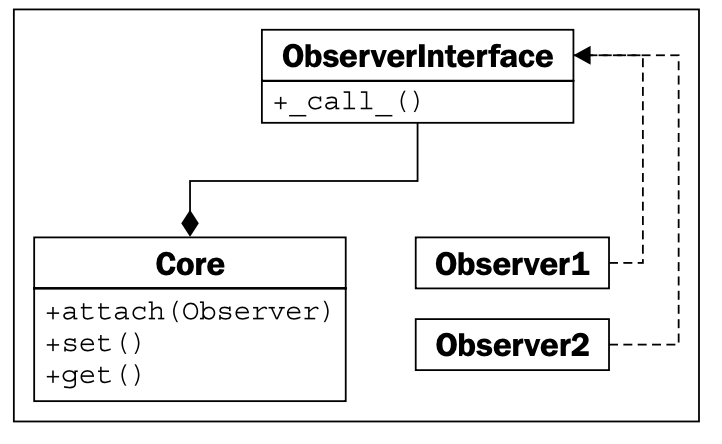
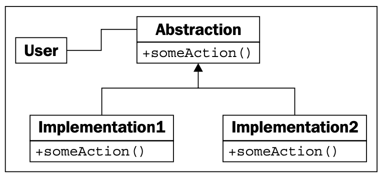
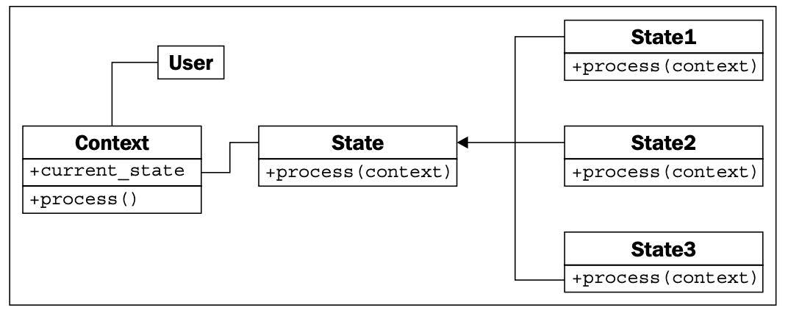
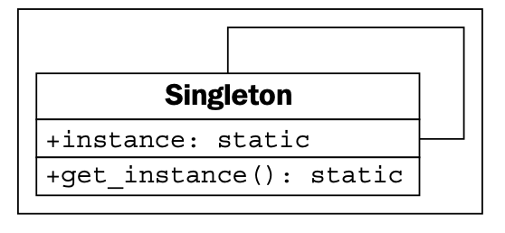
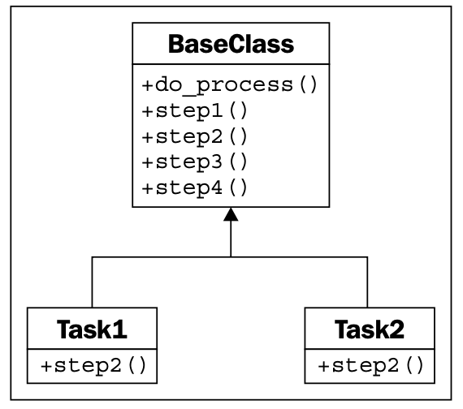

#### [GO TO BACK](../README.md)

# 10. Python Design Patterns

### The Decorator pattern

#### [example 코드](./ch10-decorator-sock-socket.py)

### The Observer pattern

#### [example 코드](./ch10-observer.py)

### The Strategy pattern

#### [example 코드](./ch10-strategy.py)

### The State pattern

#### [example 코드](./ch10-state.py)

### The Singleton pattern

#### [example 코드](./ch10-singleton.py)

### The Template pattern

#### [example 코드](./ch10-template.py)
