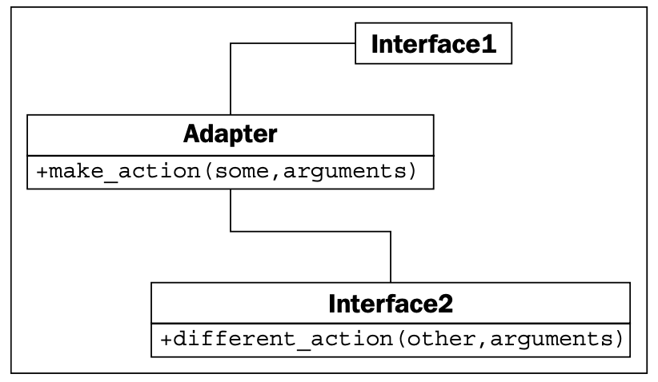
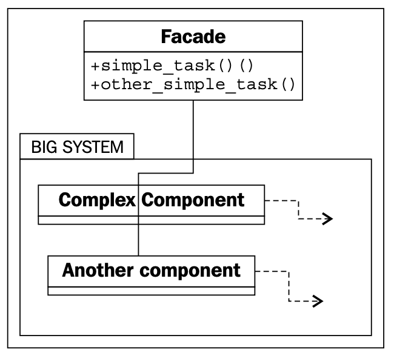
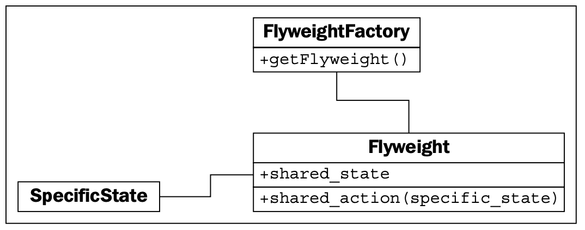
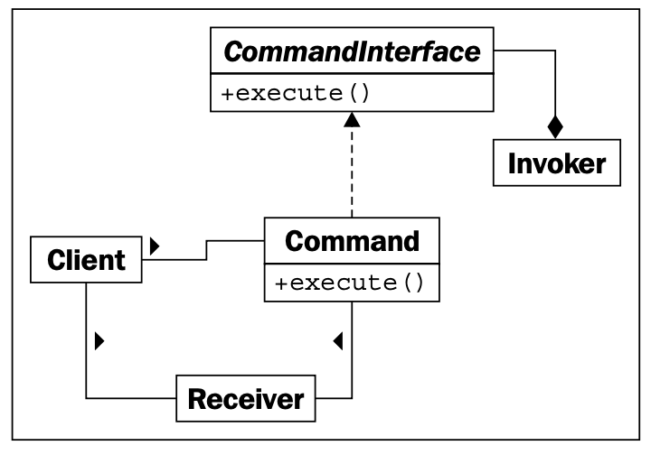
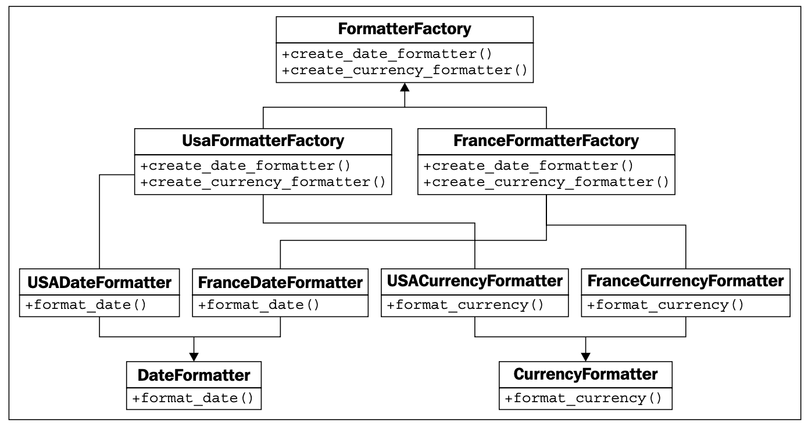
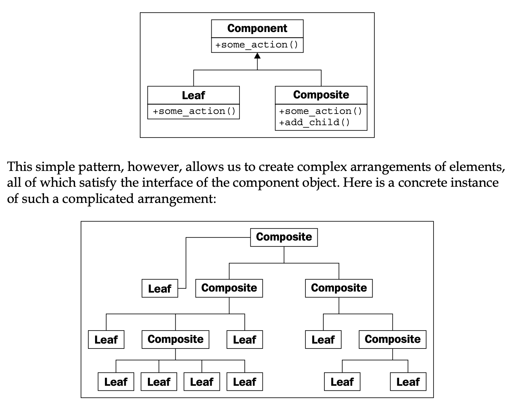

#### [GO TO BACK](../README.md)

# 11. Python Design Patterns II

### The Adapter pattern

#### [example 코드](./ch11-adapter.py)

### The Facade pattern

#### [example 코드](./ch11-facade.py)

### The Flyweight pattern

#### [example 코드](./ch11-flyweight.py)

### The Command pattern

#### [example 코드](./ch11-command.py)

### The Factory pattern

#### [example 코드](./ch11-factory.py)

### The Composition pattern

#### [example 코드](./ch11-composite.py)
