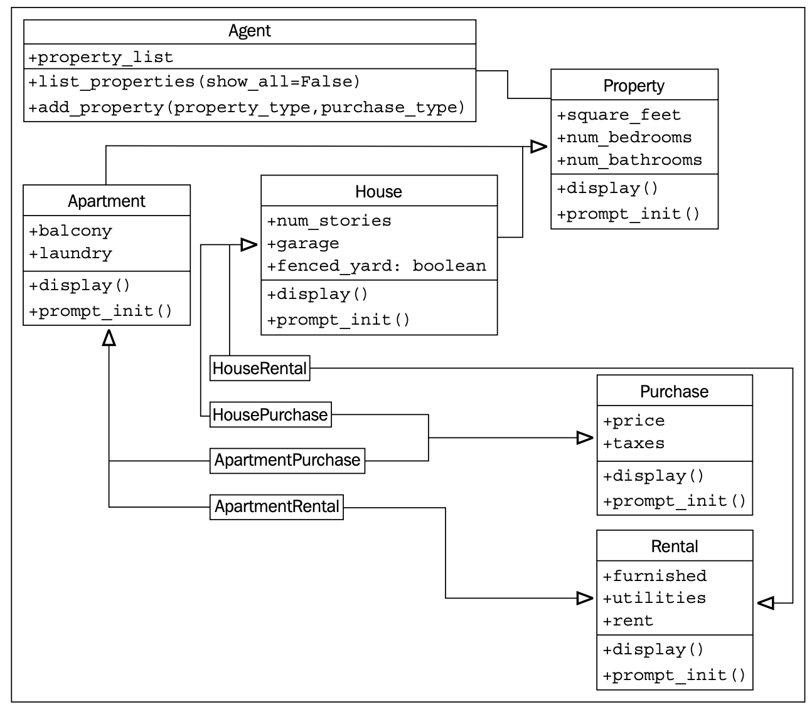

#### [GO TO BACK](../README.md)

# 3. When Objects Are Alike

### Basic inheritance
- [코드](./ch3-inherit.py)

### Extending built-ins
- [코드](./ch3-extends.py)

### Overriding and super
```python
class Friend(Contact):
    def __init__(self, name, email, phone):
        self.name = name
        self.email = email
        self.phone = phone

class Friend(Contact):
    def __init__(self, name, email, phone):
        super().__init__(name, email)
        self.phone = phone
```

### Multiple inheritance
```python
class MailSender:
    def send_mail(self, message):
        print('Sending mail to ' + self.email)

class EmailableContact(Contact, MailSender):
    pass
```

### Different sets of arguments
```python
class Contact:
    all_contacts = []

    def __init__(self, name='', email='', **kwargs):
        super().__init(**kwargs)
        self.name = name
        self.email = email
        self.all_contacts.append(self)

class AddressHolder:
    def __init__(self, street='', city='', state='', code='', **kwargs):
        super().__init__(**kwargs)
        self.street = street
        self.city = city
        self.state = state
        self.code = code

class Friend(Contact, AddressHolder):
    def __init__(self, phone='', **kwargs):
        super().__init__(**kwargs)
        self.phone = phone
```

### Polymorphism
```python
class AudioFile:
    def __init__(self, filename):
        if not filename.endswith(self.ext):
            raise Exception("Invalid file format")

        self.filename = filename

class MP3File(AudioFile):
    ext = "mp3"
    def play(self):
        print("playing {} as mp3".format(self.filename))

class WavFile(AudioFile):
    ext = "wav"
    def play(self):
        print("playing {} as wav".format(self.filename))

class OggFile(AudioFile):
    ext = "ogg"
    def play(self):
        print("playing {} as ogg".format(self.filename))

class FlacFile:
    def __init__(self, filename):
        if not filename.endswith(self.ext):
            raise Exception("Invalid file format")

        self.filename = filename
        
    def play(self):
        print("playing {} as flac".format(self.filename))

```

#### Creating an abstract base class
- [코드](./ch3-abstract.py)

#### Case Study

- [코드](./ch3-case-study.py)
